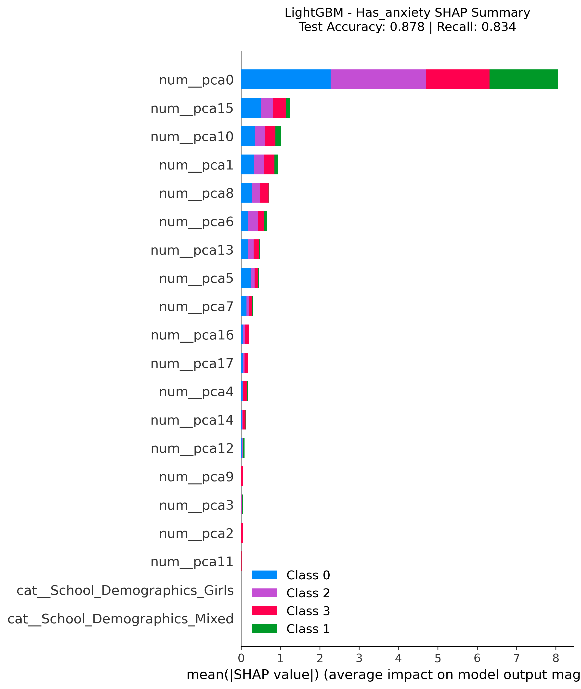
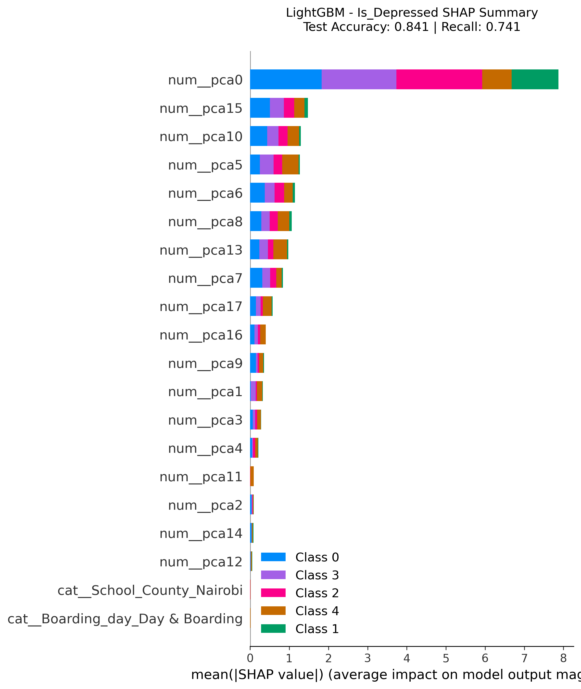
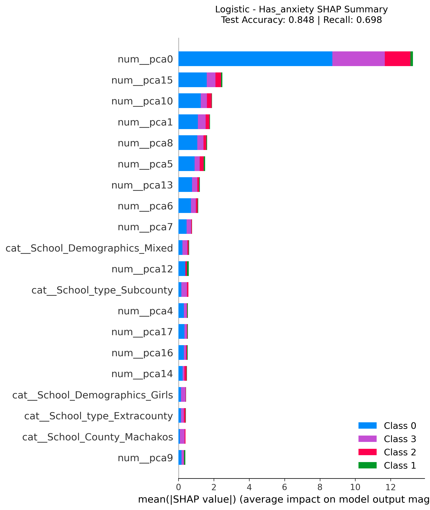
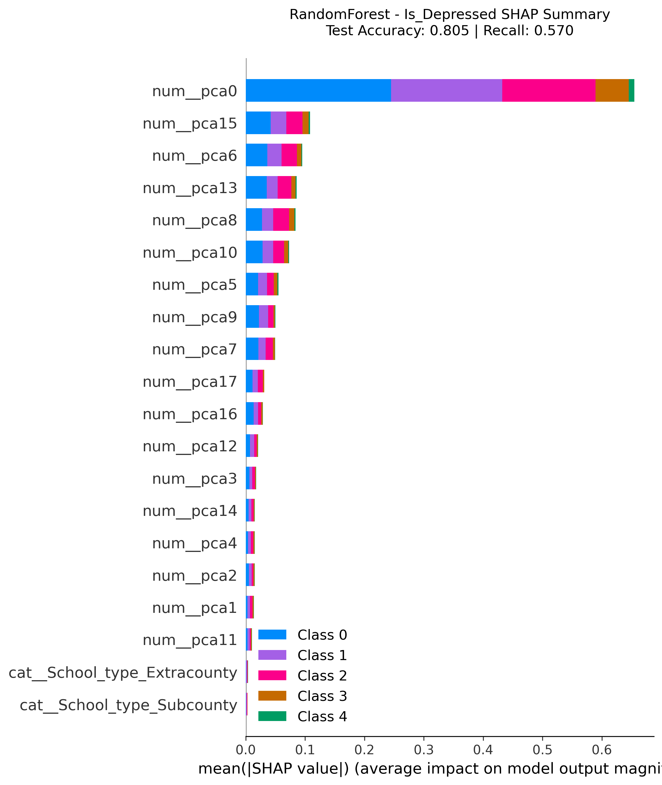
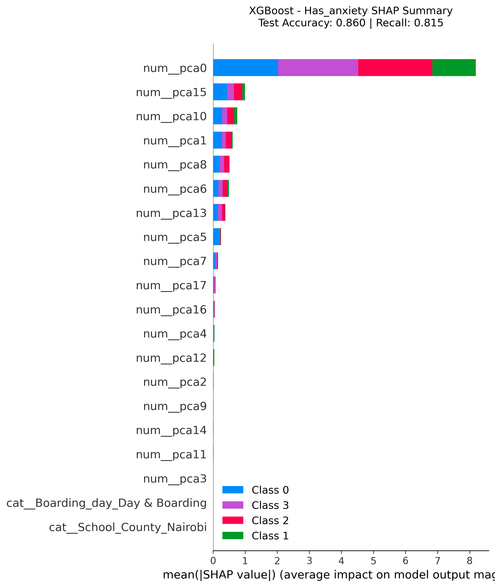

# Mental Health Screening - Kenya
# AdolescentMind: Predicting Anxiety and Depression in Adolescents
## Project Overview
This project develops an **Machine Learning Model** to predict depression (PHQ-8) and anxiety (GAD-7) symptoms among adolescents in Kenya.  
Using machine learning trained on local survey data, it powers an **interactive web app** that provides early mental health risk assessments aligned with Kenya’s *Mental Health (Amendment) Act, 2022*.
>  **Disclaimer:** This tool is for **screening**, not diagnosis.  
> For professional help, consult a qualified healthcare provider.
## Business Understanding
Mental health challenges among adolescents are rising. The **WHO (2023)** reports that 1 in 7 teenagers (ages 10–19) experience a mental health disorder.  
This project aims to create a **data-driven early detection system** using responses from the PHQ-9 and GAD-7 questionnaires plus demographic information to identify students at risk of depression or anxiety.
**Objectives:**
- Build models that classify risk levels for depression and anxiety.  
- Improve early screening access in schools through an interpretable  app.  
- Support national mental health policies focused on prevention and education.
## Methodology
1. **Data Preparation:** Cleaned, encoded, and scaled demographic and screening data.  
2. **EDA:** Used `seaborn` and `matplotlib` to visualize distributions, correlations, and outliers.  
3. **Modeling:** Trained Logistic Regression, Random Forest, XGBoost, and LightGBM models.  
4. **Evaluation:** Measured performance using accuracy, recall, precision, and F1-score(Recal and Accuracy being the main metrics).  
5. **Interpretability:** Applied **SHAP** to identify key influencing features.  
6. **Deployment:** Integrated all our models into an interactive **Streamlit** application where the model with the best recall for each target is chosen in real-time to do a prediction.
## Key Insights
- **Best Model:** LightGBM (strongest recall and interpretability).  
- **Top Predictors:** PHQ-9 and GAD-7 responses, academic self-perception, and gender.  
- **Insight:** Emotional and academic self-view indicators strongly influence risk classification.  
- **Recommendation:** Deploy this model as an early alert system in Kenyan schools.
## Important Visuals
Below are key visuals that summarize model performance, feature importance, and mental health trends in the dataset:
| Visualization | Description |
|---------------|-------------|
|  | Distribution of GAD-7 questionnaire responses |
|  | SHAP interpretation for LightGBM anxiety model |
|  | SHAP interpretation for LightGBM depression model |
|  | Logistic Regression SHAP analysis (Anxiety) |
|  | Logistic Regression SHAP analysis (Depression) |
|  | Distribution of PHQ-9 and GAD-7 scores by gender |
|  | Co-occurrence of depression and anxiety |
|  | Distribution of PHQ-9 questionnaire responses |
|  | Initial model feature ranking (part 1) |
|  | Initial model feature ranking (part 2) |
|  | Overall prevalence of both disorders |
|  | Random Forest SHAP values (Anxiety model) |
|  | Random Forest SHAP values (Depression model) |
|  | XGBoost SHAP summary for anxiety |
|  | XGBoost SHAP summary for depression |
# How to Run
## Notebook
### Clone repository
git clone git@github.com:r0sh1ddy/Depression-Anxiety-predictor-for-High-School-Students-in-Kenya.git
cd AdolescentMind
### Install dependencies
pip install -r requirements.txt
### Launch analysis notebook
jupyter notebook index.ipynb
## Mental Health Screening App
# Run Streamlit app
- bash
streamlit run app.py

